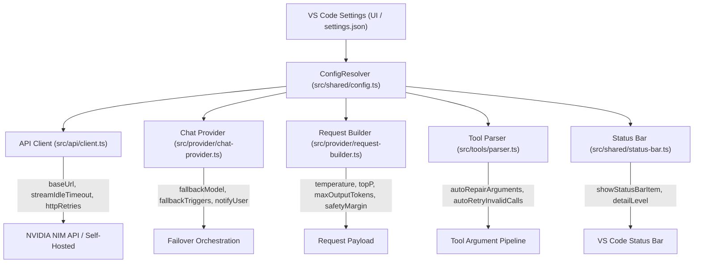

# 🚀 Архитектурный план: Полномасштабная система настроек NVIDIA NIM Provider

Данный документ описывает целевую архитектуру, спецификацию конфигураций, схему интеграции и пошаговый план реализации корпоративной системы настроек для расширения **NVIDIA NIM Provider for VS Code**.

---

## 🎯 Цели и ключевые возможности

1. **Гибкая отказоустойчивость (Configurable Failover):** Возможность выбора целевой модели для Fallback (`Nemotron Lightning`, `DeepSeek Flash`, `Kimi k2.6`, `GLM 5.2` и др.) и настройка триггеров переключения (`429/529 Rate Limit`, `404 Not Found`, `Empty Stream`, `Timeout`).
2. **Поддержка локальных/корпоративных NIM (Self-Hosted Support):** Настройка `baseUrl` для подключения к собственным кластерам NVIDIA NIM в закрытом контуре компании (On-Premises / Private Cloud).
3. **Управление таймаутами и сетевыми ретраями:** Тонкая настройка времени ожидания стрима и количества попыток при сбоях сети.
4. **Контроль параметров генерации:** Переопределение температуры, Top-P, ограничения токенов и отображения рассуждений (`<think>...`).
5. **Автоматический ремонт инструментов:** Управление эвристиками починки аргументов и повторных запросов при синтаксических ошибках модели.
6. **Полная обратная совместимость:** Бесшовный перенос существующих настроек (`showReasoning`, `reasoningMode`).

---

## 🏗️ Архитектура распространения настроек



---

## 📋 Спецификация конфигураций (`package.json`)

### 1. 🔄 Группа `nvidia-nim.fallback.*` (Отказоустойчивость)

```json
{
  "nvidia-nim.fallback.enabled": {
    "type": "boolean",
    "default": true,
    "description": "Включить автоматический переход на резервную модель при сбоях бэкенда."
  },
  "nvidia-nim.fallback.model": {
    "type": "string",
    "enum": [
      "nvidia/nemotron-3.5-lightning-30b-a3b",
      "deepseek-ai/deepseek-v4-flash-0731",
      "moonshotai/kimi-k2.6",
      "z-ai/glm-5.2",
      "minimaxai/minimax-m3",
      "stepfun-ai/step-3.7-flash"
    ],
    "default": "nvidia/nemotron-3.5-lightning-30b-a3b",
    "description": "Модель, на которую выполняется переключение при отказе основной модели."
  },
  "nvidia-nim.fallback.onRateLimit": {
    "type": "boolean",
    "default": true,
    "description": "Выполнять fallback при перегрузке серверов или исчерпании квот (HTTP 429 / 529)."
  },
  "nvidia-nim.fallback.onModelUnavailable": {
    "type": "boolean",
    "default": true,
    "description": "Выполнять fallback, если выбранная модель временно отключена на сервере (HTTP 404)."
  },
  "nvidia-nim.fallback.onEmptyStream": {
    "type": "boolean",
    "default": true,
    "description": "Выполнять fallback, если модель зависла и вернула пустой ответ после всех попыток."
  },
  "nvidia-nim.fallback.onTimeout": {
    "type": "boolean",
    "default": true,
    "description": "Выполнять fallback при превышении таймаута ожидания ответа."
  },
  "nvidia-nim.fallback.notifyUser": {
    "type": "boolean",
    "default": true,
    "description": "Показывать информационное уведомление в VS Code при активации fallback."
  }
}
```

---

### 2. 🌐 Группа `nvidia-nim.network.*` (Сеть и Self-Hosted)

```json
{
  "nvidia-nim.network.baseUrl": {
    "type": "string",
    "default": "https://integrate.api.nvidia.com/v1",
    "description": "Базовый URL эндпоинта NVIDIA NIM. Укажите адрес локального инстанса для работы в закрытом контуре (Self-Hosted)."
  },
  "nvidia-nim.network.streamIdleTimeout": {
    "type": "integer",
    "default": 120,
    "minimum": 15,
    "maximum": 600,
    "description": "Максимальное время ожидания данных в потоке (в секундах) перед фиксацией зависания сокета."
  },
  "nvidia-nim.network.maxHttpRetries": {
    "type": "integer",
    "default": 3,
    "minimum": 0,
    "maximum": 10,
    "description": "Количество повторных попыток при временных ошибках сети и кодах 429/502/503/504."
  },
  "nvidia-nim.network.maxEmptyStreamRetries": {
    "type": "integer",
    "default": 2,
    "minimum": 0,
    "maximum": 5,
    "description": "Количество повторных запросов при получении пустого ответа от модели."
  }
}
```

---

### 3. 🧠 Группа `nvidia-nim.reasoning.*` и `generation.*` (Рассуждения и генерация)

```json
{
  "nvidia-nim.reasoning.mode": {
    "type": "string",
    "enum": ["none", "on", "medium", "high", "max"],
    "default": "none",
    "description": "Уровень рассуждений по умолчанию для поддерживающих моделей."
  },
  "nvidia-nim.reasoning.showInChat": {
    "type": "boolean",
    "default": false,
    "description": "Отображать мыслительный процесс модели (<think>) в окне чата."
  },
  "nvidia-nim.generation.temperature": {
    "type": ["number", "null"],
    "default": null,
    "minimum": 0.0,
    "maximum": 2.0,
    "description": "Переопределение температуры генерации (null — использовать настройки адаптера модели)."
  },
  "nvidia-nim.generation.topP": {
    "type": ["number", "null"],
    "default": null,
    "minimum": 0.0,
    "maximum": 1.0,
    "description": "Параметр Top-P сэмплирования (null — значение по умолчанию)."
  },
  "nvidia-nim.generation.maxOutputTokens": {
    "type": ["integer", "null"],
    "default": null,
    "minimum": 128,
    "maximum": 131072,
    "description": "Лимит максимального количества выходных токенов на ответ."
  }
}
```

---

### 4. 🧰 Группа `nvidia-nim.tools.*` (Инструменты и исправления)

```json
{
  "nvidia-nim.tools.autoRepairArguments": {
    "type": "boolean",
    "default": true,
    "description": "Автоматически восстанавливать строковые JSON-массивы, отсутствующие кавычки и структуру аргументов."
  },
  "nvidia-nim.tools.autoRetryInvalidCalls": {
    "type": "boolean",
    "default": true,
    "description": "Отправлять системную подсказку модели с требованием исправить вызов при повреждении параметров."
  }
}
```

---

### 5. 📦 Группа `nvidia-nim.context.*` (Контекст и память)

```json
{
  "nvidia-nim.context.autoCompactOnOverflow": {
    "type": "boolean",
    "default": true,
    "description": "Автоматически сжимать старые сообщения при ошибке переполнения контекста (HTTP 400)."
  },
  "nvidia-nim.context.safetyMarginPercent": {
    "type": "number",
    "default": 1.0,
    "minimum": 0.0,
    "maximum": 10.0,
    "description": "Процент резервируемого буфера контекстного окна для защиты от погрешностей токенизатора."
  }
}
```

---

### 6. 📊 Группа `nvidia-nim.ui.*` и `developer.*` (Интерфейс и отладка)

```json
{
  "nvidia-nim.ui.showStatusBarItem": {
    "type": "boolean",
    "default": true,
    "description": "Отображать индикатор NVIDIA NIM и статистику токенов в строке состояния VS Code."
  },
  "nvidia-nim.developer.debugLogging": {
    "type": "boolean",
    "default": false,
    "description": "Включить подробное логирование запросов, SSE-чанков и метрик в Output Channel."
  },
  "nvidia-nim.developer.logTimingBreakdowns": {
    "type": "boolean",
    "default": true,
    "description": "Логировать детальные метрики скорости генерации (токены/сек, TTFT, задержки сети)."
  }
}
```

---

## 🗓️ План внедрения по этапам

### Этап 1: Декларация схемы в `package.json`
* Добавить все секции конфигураций с локализацией описаний, ограничениями диапазонов и типами.
* Обеспечить обратную совместимость со старыми ключами (`nvidia-nim.showReasoning`, `nvidia-nim.reasoningMode`).

### Этап 2: Создание типизированного модуля `ConfigManager` ([`src/shared/config.ts`](file:///C:/Users/bauir/source/project/nvidia-nim-provider/src/shared/config.ts))
* Создать централизованный типизированный модуль для чтения настроек с поддержкой fallback-значений по умолчанию и кеширования.

### Этап 3: Подключение к сетевому слою ([`src/api/client.ts`](file:///C:/Users/bauir/source/project/nvidia-nim-provider/src/api/client.ts))
* Поддержать динамический `baseUrl` (вместо константы).
* Поддержать настраиваемый `streamIdleTimeout`, `maxHttpRetries`, `maxEmptyStreamRetries`.

### Этап 4: Подключение к `ChatProvider` и Failover ([`src/provider/chat-provider.ts`](file:///C:/Users/bauir/source/project/nvidia-nim-provider/src/provider/chat-provider.ts))
* Реализовать динамический выбор fallback-модели из настроек (`nvidia-nim.fallback.model`).
* Добавить срабатывание fallback при стойком `empty_stream` и таймаутах.
* Поддержать флаги `notifyUser`, `autoCompactOnOverflow` и переопределение `temperature`/`topP`.

### Этап 5: Подключение к парсеру инструментов ([`src/tools/parser.ts`](file:///C:/Users/bauir/source/project/nvidia-nim-provider/src/tools/parser.ts))
* Связать флаг `autoRepairArguments` с конвейером починки аргументов.

### Этап 6: Тестирование и верификация
* Написать юнит-тесты на каждый параметр конфигурации и граничные случаи (невалидный URL, кастомная модель fallback, нулевой таймаут).
* Прогнать полный тестовый сьют (504+ теста).
