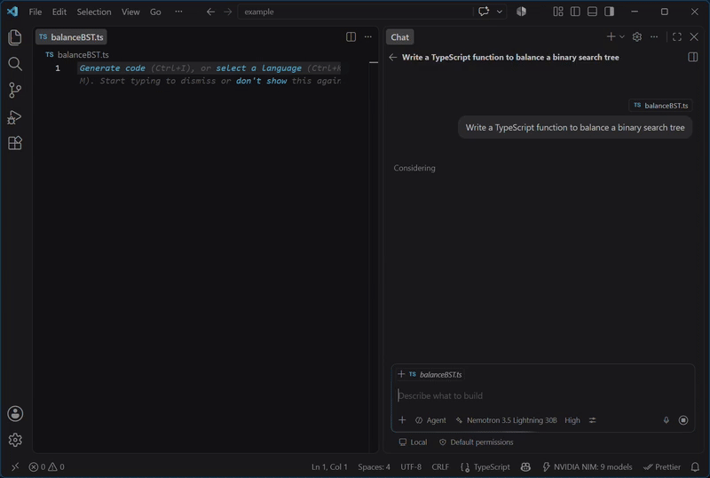

# NVIDIA NIM Agent for VS Code

**Direct, zero-markup access to NVIDIA NIM's premier open & proprietary reasoning models right inside GitHub Copilot Chat.**

[Install](https://marketplace.visualstudio.com/items?itemName=neuraldock.nvidia-nim-agent) • [Key Features](#-key-features) • [Supported Models](#-supported-models) • [Quick Start](#-quick-start) • [FAQ](#-frequently-asked-questions) • [Commands](#-extension-commands)

 

> **Free Access:** NVIDIA provides free developer API at [build.nvidia.com](https://build.nvidia.com/models). You can use DeepSeek V4, Nemotron, and Kimi directly inside Copilot without any monthly provider subscriptions.

---

## 🚀 Why NVIDIA NIM Agent?

Modern software engineering demands high-precision reasoning, long context understanding, and reliable autonomous tool execution. **NVIDIA NIM Agent** connects VS Code directly to NVIDIA's high-throughput NIM Cloud infrastructure, unlocking flagship models with minimal latency, zero intermediary proxy overhead, and production-grade resilience.

---

## ✨ Key Features

### 🧠 Native Deep Reasoning
- **Collapsible Thinking Blocks:** Fully supports VS Code's native `LanguageModelThinkingPart` API. Reasoning output from models like **DeepSeek V4**, **Kimi K2.6**, and **Nemotron 3.5** renders as clean, collapsible thinking sections rather than cluttering your chat stream.
- **Granular Effort Control:** Select reasoning modes (`None`, `On`, `Medium`, `High`, `Max`) directly from the Copilot model picker dropdown.

### 🛡️ Zero-Downtime Smart Failover
- **Transient Turn-Level Failover:** If an active model experiences rate limits (`HTTP 429/529`), temporary unavailability (`404`), an empty stream, or a slow first-token timeout (TTFT), the extension instantly routes the current turn to a lightning backup model (e.g. `nvidia/nemotron-3.5-lightning-30b-a3b`).
- **Automatic Recovery:** Automatically restores your preferred primary model on the subsequent turn.
- **Transparent Notifications:** Clear in-chat callout badges (`> ⚡ **NVIDIA NIM Fallback:** ...`) and status notifications keep you informed without interrupting workflow.

### 🛠️ Self-Healing Agentic Tool Execution
- **Tag-Stack XML Scanner:** Single-pass streaming scanner compatible with Hermes, Nemotron, Anthropic, Qwen, and DeepSeek syntax.
- **Self-Healing Repair:** Automatically rectifies unescaped strings, trailing JSON commas, and parameter aliases (`filePath` ⇄ `path` ⇄ `file`).
- **Loop Prevention:** Safely suppresses identical consecutive read-only operations while permitting intentional terminal command retries.

### 🗜️ Dedicated Context Auto-Compaction
- **Decoupled Summarization:** Leverages a dedicated, ultra-fast model (`context.summarizationModel`) to condense lengthy dialogue history without altering your primary model configuration.
- **Dynamic Safety Margins:** Automatically allocates safety buffers for large context windows ($\ge 256\text{K}$) to prevent sudden payload overflow errors.

### 📊 Real-Time Token & Latency Telemetry
- **Rich Status Bar Breakdown:** Real-time token utilization widget displaying exact breakdowns across system prompts, tool schemas, user history, thinking tokens, and completions.
- **Developer Metrics:** Optional millisecond-level TTFT and generation tokens-per-second logs for benchmarking model performance.

---

## 🌟 Supported Models

The extension connects to official NVIDIA NIM endpoints (`https://integrate.api.nvidia.com/v1`) and provides model-specific prompt adapters:

| Model | Context Window | Reasoning Modes | Tool Calling | Vision | Best For |
| :--- | :---: | :---: | :---: | :---: | :--- |
| **DeepSeek V4 Flash 0731** | 1M | `None`, `High`, `Max` | ✅ Yes | ❌ | Deep algorithm design, code architecture, complex refactoring |
| **Kimi K2.6** *(Deprecated)* | 262K | `None`, `On` | ✅ Yes | ✅ Yes | Long-context repository comprehension, multimodal review *(auto-fails over to MiniMax M3)* |
| **Nemotron 3.5 Lightning 30B** | 1M | `None`, `Medium`, `High`, `XHigh` | ✅ Yes | ❌ | Ultra-fast responses, agentic tool workflows, summarization |
| **Nemotron 3 Ultra 550B** | 1M | `None`, `Medium`, `High` | ✅ Yes | ❌ | Heavy multi-step reasoning, deep technical documentation |
| **MiniMax M3** | 1M | `None`, `On`, `Adaptive` | ✅ Yes | ✅ Yes | Multimodal code generation, full-stack tasks |
| **GLM 5.2** | 1M | `None`, `On` | ✅ Yes | ❌ | Precise instruction following, rigorous logic |
| **Step 3.7 Flash** | 262K | `Always On` | ✅ Yes | ✅ Yes | Rapid thinking loops, interactive pair programming |
| **Inkling** | 1M | `None` to `Max` (7 levels) | ✅ Yes | ✅ Yes | Ultra-deep analytical inspection |
| **Muse Glimmer** | 131K | `None` to `XHigh` | ✅ Yes | ✅ Yes | Visual UX/UI analysis and front-end generation |

---

## ⚡ Quick Start

### 1. Install
- [Install from the VS Code Marketplace](https://marketplace.visualstudio.com/items?itemName=neuraldock.nvidia-nim-agent), or
- Quick Open (`Ctrl + P` / `Cmd + P`): `ext install neuraldock.nvidia-nim-agent`

### 2. Requirements
- **VS Code 1.125.0** or later
- **GitHub Copilot** extension installed and active
- **NVIDIA NIM API Key** (Get free credits at [build.nvidia.com](https://build.nvidia.com/models))

### 3. Configure Your API Key
1. Open Copilot Chat (`Ctrl + Alt + I` / `Cmd + Alt + I`).
2. Click the model selector dropdown $\rightarrow$ **Manage Models** $\rightarrow$ **NVIDIA NIM**.
3. Paste your NVIDIA NIM API key (`nvapi-...`).

*(Alternatively, run `NVIDIA NIM: Manage NVIDIA NIM API Key` from the Command Palette).*

### 4. Start Chatting & Coding
Select any NVIDIA NIM model in Copilot Chat or Copilot Agent Mode and start building!

---

## ⌨️ Extension Commands

Access these commands anytime from the VS Code Command Palette (`Ctrl + Shift + P` / `Cmd + Shift + P`):

| Command | Identifier | Description |
| :--- | :--- | :--- |
| **Manage API Key** | `nvidia-nim.manage` | Store or update your NVIDIA NIM API key. |
| **Refresh Models** | `nvidia-nim.refreshModels` | Force re-sync available models from your NVIDIA account. |
| **Toggle Debug Logging** | `nvidia-nim.toggleDebugLogging` | Enable/disable verbose diagnostic logs. |
| **Open Debug Log** | `nvidia-nim.openDebugLog` | Reveal the dedicated NVIDIA NIM Output Channel. |

---

## 🔒 Privacy & Security

- **Direct Communication:** Requests flow strictly between your VS Code client and the official NVIDIA NIM API (`https://integrate.api.nvidia.com/v1`). There are zero third-party telemetry servers or proxy gateways.
- **Secure Secret Storage:** API keys are encrypted and stored inside VS Code's native OS-level credential vault (`SecretStorage`).
- **No Data Retention by Extension:** The extension retains no chat logs, file contents, or personal credentials.

---

## ❓ Frequently Asked Questions

**Q: Do I need a paid NVIDIA subscription?**  
A: No. NVIDIA provides free API on [build.nvidia.com](https://build.nvidia.com/models) for developers.

**Q: Does it work with Copilot Agent Mode and Tools?**  
A: Yes! Supported chat models are tool-capable and support autonomous file editing, terminal execution, and MCP tools with automatic JSON repair.

---

## 📄 License

This project is licensed under the [MIT License](LICENSE).

