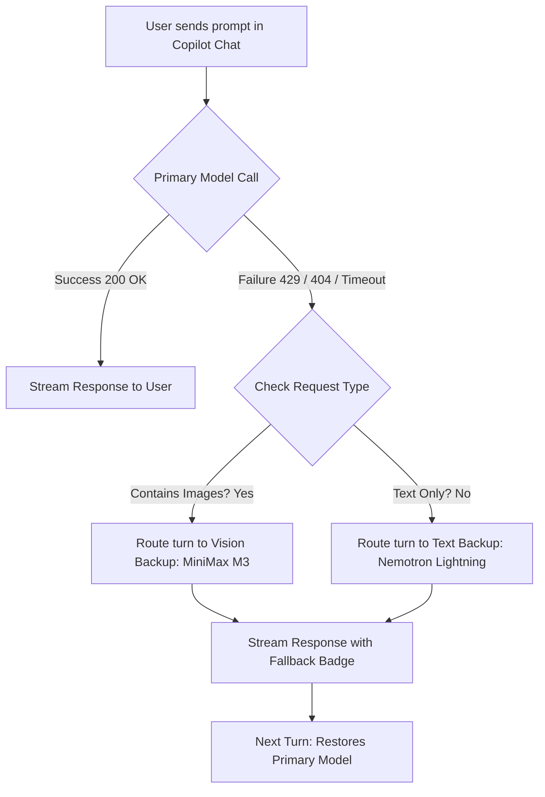

# NVIDIA NIM Agent — Complete User Guide & Documentation

Welcome to the definitive guide for **NVIDIA NIM Agent for VS Code**. This documentation is designed to be completely exhaustive: whether you are a beginner setting up your first API key or an engineer fine-tuning token budgets and failover policies, every single concept, feature, setting, and troubleshooting step is explained here in plain English.

---

## 📑 Table of Contents

1. [🚀 Getting Started (Step-by-Step for Beginners)](#-getting-started-step-by-step-for-beginners)
   - [Step 1: Getting your Free NVIDIA NIM API Key](#step-1-getting-your-free-nvidia-nim-api-key)
   - [Step 2: Installing Requirements](#step-2-installing-requirements)
   - [Step 3: Entering Your API Key in VS Code](#step-3-entering-your-api-key-in-vs-code)
   - [Step 4: Selecting Models & Chatting](#step-4-selecting-models--chatting)
2. [🌟 Model Guide: Which Model Should You Choose?](#-model-guide-which-model-should-you-choose)
   - [Model Comparison Matrix](#model-comparison-matrix)
   - [Detailed Model Breakdown & Best Use Cases](#detailed-model-breakdown--best-use-cases)
3. [🧠 How Deep Reasoning (Thinking) Works](#-how-deep-reasoning-thinking-works)
   - [Collapsible Thinking Blocks](#collapsible-thinking-blocks)
   - [Controlling Reasoning Effort](#controlling-reasoning-effort)
4. [🛡️ Smart Failover Engine (Zero Downtime)](#️-smart-failover-engine-zero-downtime)
   - [How Failover Works (Turn-Level Routing)](#how-failover-works-turn-level-routing)
   - [Text vs. Vision Multimodal Failover](#text-vs-vision-multimodal-failover)
   - [Collision Protection](#collision-protection)
   - [In-Chat Notice Banners](#in-chat-notice-banners)
5. [🛠️ Agentic Tool Execution & Self-Healing](#️-agentic-tool-execution--self-healing)
   - [How Copilot Agent Mode Edits Files & Runs Commands](#how-copilot-agent-mode-edits-files--runs-commands)
   - [Tag-Stack XML Streaming Parser](#tag-stack-xml-streaming-parser)
   - [Automatic JSON Repair (`jsonrepair`)](#automatic-json-repair-jsonrepair)
   - [Loop Prevention (Duplicate Read Suppression)](#loop-prevention-duplicate-read-suppression)
6. [🗜️ Long Context Management & Auto-Compaction](#️-long-context-management--auto-compaction)
   - [Why Context Windows Overflow](#why-context-windows-overflow)
   - [Decoupled Background Summarization](#decoupled-background-summarization)
   - [Safety Margin Buffer](#safety-margin-buffer)
7. [⚙️ Complete Configuration Reference (`settings.json`)](#️-complete-configuration-reference-settingsjson)
   - [All 32 Settings Explained in Detail](#all-32-settings-explained-in-detail)
   - [Ready-to-Copy `settings.json` Presets](#ready-to-copy-settingsjson-presets)
8. [⌨️ Extension Commands Reference](#-extension-commands-reference)
9. [🖼️ Built-in Tools: Image Analysis](#️-built-in-tools-image-analysis)
10. [🔍 Troubleshooting & Diagnosing Issues (FAQ)](#-troubleshooting--diagnosing-issues-faq)
    - [How to View and Export Debug Logs](#how-to-view-and-export-debug-logs)
    - [Common Error Codes and Fixes](#common-error-codes-and-fixes)
    - [Privacy & Security Guarantee](#privacy--security-guarantee)

---

## 🚀 Getting Started (Step-by-Step for Beginners)

### Step 1: Getting your Free NVIDIA NIM API Key
NVIDIA provides free inference credits to all developers on their Build platform.
1. Open your web browser and go to [**build.nvidia.com/explore/discover**](https://build.nvidia.com/explore/discover).
2. Click **Log In** in the top-right corner. You can sign in using your Google account, GitHub account, or email.
3. Click on any model (for example, **DeepSeek V4** or **Nemotron 3.5 Lightning**).
4. Click the green button labeled **Get API Key** or **Generate API Key**.
5. Copy the generated key. It starts with `nvapi-...`. Keep this safe!


---

### Step 2: Installing Requirements
Before using the extension, make sure you have:
1. **VS Code** (version `1.125.0` or newer).
2. **GitHub Copilot** extension installed and logged in.
3. **NVIDIA NIM Agent** extension installed from the [VS Code Marketplace](https://marketplace.visualstudio.com/items?itemName=neuraldock.nvidia-nim-agent).

---

### Step 3: Entering Your API Key in VS Code
There are two easy ways to store your API key:

#### Method A: Via Copilot Chat Model Selector (Recommended)
1. Open GitHub Copilot Chat in VS Code (`Ctrl + Alt + I` on Windows/Linux, or `Cmd + Alt + I` on macOS).
2. Click the model dropdown picker at the bottom of the chat box.
3. Click **Manage Models...** $\rightarrow$ select **NVIDIA NIM**.
4. Paste your `nvapi-...` key into the input box at the top of the editor and press **Enter**.

#### Method B: Via Command Palette
1. Press `Ctrl + Shift + P` (or `Cmd + Shift + P` on macOS) to open the Command Palette.
2. Type `NVIDIA NIM: Manage NVIDIA NIM API Key` and press **Enter**.
3. Paste your `nvapi-...` key and hit **Enter**.

> [!NOTE]
> Your key is securely encrypted inside your operating system's native credential vault (`VS Code SecretStorage`). It is **never** sent to any third party and never logged in plain text.

---

### Step 4: Selecting Models & Chatting
1. In the Copilot Chat window, click the model selector dropdown.
2. You will see models provided by **NVIDIA NIM** (e.g. `DeepSeek V4 Flash 0731`, `Nemotron 3.5 Lightning 30B`, `MiniMax M3`, etc.).
3. Choose your desired model and start coding!

---

## 🌟 Model Guide: Which Model Should You Choose?

NVIDIA NIM hosts a diverse range of specialized models. Here is how to pick the best model for your exact task:

### Model Comparison Matrix

| Model Name | Picker Name | Context Limit | Max Output | Thinking / Reasoning | Vision (Images) | Recommended For |
| :--- | :--- | :---: | :---: | :---: | :---: | :--- |
| **DeepSeek V4 Flash 0731** | `DeepSeek V4 Flash 0731` | **1,048,576** tokens | 131,072 | `None`, `High`, `Max` | ❌ No | Hard algorithmic challenges, complex architectural refactors, deep math |
| **Kimi K3** | `Kimi K3` | **1,048,576** tokens | 65,536 | `None`, `Low`, `High`, `Max` | ✅ **Yes** | Flagship long-context reasoning, multimodal docs, agentic research |
| **Nemotron 3.5 Lightning 30B** | `Nemotron 3.5 Lightning 30B` | **1,000,000** tokens | 32,768 | `None`, `Medium`, `High`, `XHigh` | ❌ No | Lightning-fast responses, autonomous Copilot Agent file edits, summarization |
| **Nemotron 3 Ultra 550B** | `Nemotron 3 Ultra 550B` | **1,000,000** tokens | 65,536 | `None`, `Medium`, `High` | ❌ No | Heavy multi-file reasoning, high-stakes system design, enterprise documentation |
| **MiniMax M3** | `MiniMax M3` | **1,000,000** tokens | 100,000 | `None`, `On`, `Adaptive` | ✅ **Yes** | Multimodal coding, screenshot debugging, full-stack web UI design |
| **Step 3.7 Flash** | `Step 3.7 Flash` | **262,144** tokens | 262,144 | `Always On` | ✅ **Yes** | Rapid pair programming, visual inspections, interactive live coding |
| **Inkling** | `Inkling` | **1,048,576** tokens | 65,536 | `None` to `Max` (7 levels) | ✅ **Yes** | Deep analytical codebase exploration with highly fine-tuned thinking depths |
| **Muse Glimmer** | `Muse Glimmer` | **131,072** tokens | 32,768 | `None` to `XHigh` | ✅ **Yes** | Front-end UI generation, visual UX analysis |

---

### Detailed Model Breakdown & Best Use Cases

#### 1. Nemotron 3.5 Lightning 30B (The Daily Workhorse ⚡)
- **Why use it:** It is blazing fast and has an enormous 1-million token context window.
- **Best for:** Everyday coding, writing unit tests, explaining functions, and powering Copilot Agent mode when editing multiple workspace files.
- **Default Role:** Serves as the default text fallback model and summarization model.

#### 2. DeepSeek V4 Flash 0731 (The Deep Thinker 🧠)
- **Why use it:** Exceptional reasoning and algorithmic precision.
- **Best for:** Complex debugging, designing database schemas, writing complex SQL queries, refactoring legacy codebases, and mathematical calculations.
- **Reasoning:** Supports `None` (standard speed), `High` (balanced thought), and `Max` (deep verification).

#### 3. MiniMax M3 (The Multimodal Powerhouse 🖼️)
- **Why use it:** Features a huge 1,000,000-token context window combined with native Vision capabilities.
- **Best for:** Pasting UI screenshots to generate React/Tailwind/Vue components, inspecting architecture diagrams, reading PDF graphs, and visual bug fixing.
- **Default Role:** Serves as the default Vision fallback model.

#### 4. Inkling (The Granular Explorer 🔬)
- **Why use it:** Offers 7 distinct levels of thinking effort (`none`, `low`, `medium_low`, `medium`, `medium_high`, `high`, `max`).
- **Best for:** Fine-tuning exactly how long the model ponders before writing code.

---

## 🧠 How Deep Reasoning (Thinking) Works

### Collapsible Thinking Blocks
Many modern models (like DeepSeek V4, Nemotron 3.5, and Step 3.7) generate a internal stream of logical thought before producing the final code or answer.

- **Clean UI:** The extension filters out `<thought>`, `<think>`, or `[THINK]` tags and renders them using VS Code's native `LanguageModelThinkingPart`.
- In Copilot Chat, you will see a collapsible **Thinking...** bar. You can click to expand it and review the model's step-by-step thought process, or leave it collapsed to focus on the code.

### Controlling Reasoning Effort
You can control how deeply models think in two ways:
1. **Per-Turn in Chat (Quick):** In the Copilot Chat model dropdown, select the model with your preferred thinking mode (e.g. `DeepSeek V4 Flash 0731 (High)`).
2. **Globally via Settings:** Configure `"nvidia-nim.reasoning.mode": "high"` in `settings.json`.
3. **Plain Text Thoughts:** If you prefer thinking to appear directly as normal text instead of collapsible widgets, set `"nvidia-nim.reasoning.showInChat": true`.

---

## 🛡️ Smart Failover Engine (Zero Downtime)

### How Failover Works (Turn-Level Routing)
In Cloud AI inference, APIs can occasionally return a temporary rate limit (`HTTP 429`), server overload (`529`), a decommissioned model (`404`), an empty stream, or a network timeout. 

Instead of showing an ugly error message and ruining your workflow, **NVIDIA NIM Agent** automatically executes a **Single-Turn Failover**:
1. When a failure occurs, the extension catches the error.
2. It immediately re-routes the exact same prompt to a reliable backup model (default: **Nemotron 3.5 Lightning 30B**).
3. The backup model generates the answer without making you retype or resend your prompt.
4. **Automatic Restoration:** On your very next turn, the extension automatically switches back to your preferred primary model.



### Text vs. Vision Multimodal Failover
- If your request is **text-only**, failover routes to your configured `fallback.model` (`Nemotron 3.5 Lightning 30B`).
- If your request **contains images/screenshots**, text-only models would reject it with an error. The extension automatically detects image parts and routes the failover to `fallback.visionModel` (`MiniMax M3`).

### Fallback Priority List
Set `nvidia-nim.fallback.priorityList` to an ordered list of model IDs (editable in VS Code Settings) to try *before* the single text/vision fallbacks. On each failover step the next healthy candidate is picked; unknown, unavailable, and already-tried models are skipped. Example: `["moonshotai/kimi-k3", "minimaxai/minimax-m3"]` tries Kimi K3 first, then MiniMax M3, and only then the regular fallbacks. If every candidate fails, the error message lists the full tried chain (`Tried chain: kimi-k3 -> minimax-m3`) with the last underlying error.

### Collision Protection
If you are already chatting with the backup model (e.g. `MiniMax M3`) and *it* encounters a rate limit, the collision protection engine detects the conflict and automatically routes to the next best available model in the whitelist (such as `Step 3.7 Flash` or `Inkling`).

### In-Chat Notice Banners
When a failover occurs, the extension prints a clean badge at the top of the response:
```markdown
> ⚡ **NVIDIA NIM Fallback:** Request rate-limited on *deepseek-ai/deepseek-v4-flash-0731*. Response generated by *nvidia/nemotron-3.5-lightning-30b-a3b*.
```
*(You can disable this badge anytime with `"nvidia-nim.fallback.showNoticeInChat": false`).*

---

## 🛠️ Agentic Tool Execution & Self-Healing

### How Copilot Agent Mode Edits Files & Runs Commands
When you run Copilot in **Agent Mode**, Copilot asks the model to execute tools (such as reading files, writing code edits, searching workspaces, or running terminal commands).

Different models output tool requests in different formats:
- Some models use standard OpenAI JSON (`tool_calls`).
- Some models stream XML control blocks (e.g. `<tool_call><function=run_in_terminal>...</tool_call>`).
- Some models use Hermes or Anthropic-style tags.

### Tag-Stack XML Streaming Parser
The extension includes a unified single-pass streaming parser (`src/tools/xml-tool-scanner.ts`):
- It parses all tool formats in real time without waiting for the full response to finish.
- **Code Fence Protection:** If a model writes an example `<tool_call>` inside markdown code blocks (```` ```xml ````), the parser is smart enough to leave it as plain text rather than executing it as an accidental command.

### Automatic JSON Repair (`jsonrepair`)
Models often generate slightly malformed JSON (missing closing braces, unescaped quotes inside code snippets, trailing commas). 
- The extension passes broken tool arguments through `jsonrepair` to automatically fix syntax errors.
- It resolves parameter aliases (e.g. maps `path`, `targetFile`, `file` to `filePath`).
- If an argument is still invalid, it sends structured feedback back to the model as an internal retry turn instead of crashing.

### Loop Prevention (Duplicate Read Suppression)
Autonomous agents can occasionally get stuck in loops (e.g. reading `package.json` 5 times in a row).
- The extension tracks read-only operations and safely suppresses identical consecutive calls.
- Write operations and terminal execution (e.g. re-running a failed build) are **never** blocked.

---

## 🗜️ Long Context Management & Auto-Compaction

### Why Context Windows Overflow
In extended coding sessions, chat history, system instructions, and file contents accumulate. When total tokens approach the model's limit, requests will abruptly fail with `400 Context Window Exceeded`.

### Decoupled Background Summarization
- When conversation length approaches capacity, the extension automatically compacts older conversation turns into a dense summary.
- **Decoupled:** Compaction runs through a dedicated, fast model (`context.summarizationModel`, default: `Nemotron 3.5 Lightning 30B`). Your active primary model configuration is never disturbed.

### Safety Margin Buffer
Because tokenizers (like Byte-Pair Encoding) can produce slight estimation differences between VS Code and NVIDIA NIM servers, the extension reserves a safety margin (default: `1.0%` of context window, configurable via `context.safetyMarginPercent`) to ensure you never hit off-by-one overflow errors.

---

## ⚙️ Complete Configuration Reference (`settings.json`)

Here is the complete, exhaustive documentation for every configuration key available in the extension.

### All 32 Settings Explained in Detail (34 with 2 legacy aliases)

#### Category 1: Failover & Recovery (`nvidia-nim.fallback.*`)

| Setting Key | Type | Default | Description & Real-World Use Case |
| :--- | :---: | :---: | :--- |
| `nvidia-nim.fallback.enabled` | `boolean` | `true` | **Master Failover Toggle.** If `true`, errors trigger single-turn backup routing. If `false`, errors are surfaced immediately to the user. |
| `nvidia-nim.fallback.model` | `string` | `"nvidia/nemotron-3.5-lightning-30b-a3b"` | **Primary Text Backup Model.** ID of the model used for text requests when the active model fails. |
| `nvidia-nim.fallback.visionModel` | `string` | `"minimaxai/minimax-m3"` | **Vision Backup Model.** ID of the vision-capable model used when an image request fails. |
| `nvidia-nim.fallback.priorityList` | `string[]` | `[]` | **Ordered Failover Chain.** Models tried one by one (top to bottom) on rate limit / outage / empty response / timeout, before the configured text and vision fallbacks. Unavailable and already-tried models are skipped; if the whole chain fails, the error reports the full tried chain. |
| `nvidia-nim.fallback.onRateLimit` | `boolean` | `true` | **Failover on 429/529.** Trigger failover if NVIDIA returns rate limit or server overloaded status. |
| `nvidia-nim.fallback.onModelUnavailable` | `boolean` | `true` | **Failover on 404.** Trigger failover if a model endpoint is temporarily down or decommissioned. |
| `nvidia-nim.fallback.onEmptyStream` | `boolean` | `true` | **Failover on Empty Output.** Trigger failover if a model emits zero text chunks. |
| `nvidia-nim.fallback.onTimeout` | `boolean` | `true` | **Failover on Timeout.** Trigger failover if a stream hangs longer than `streamIdleTimeout`. |
| `nvidia-nim.fallback.firstTokenTimeoutSeconds` | `number \| null` | `null` | **TTFT Timeout (5–120s).** Max seconds to wait for the very first token. If exceeded, failover triggers immediately. Default `null` uses stream timeout. |
| `nvidia-nim.fallback.showNoticeInChat` | `boolean` | `true` | **In-Chat Callout.** If `true`, prepends a `> ⚡ NVIDIA NIM Fallback` banner to the chat response. |
| `nvidia-nim.fallback.notifyUser` | `boolean` | `true` | **VS Code Toast Notification.** If `true`, shows a popup notification when failover happens. |

---

#### Category 2: Network & Timeouts (`nvidia-nim.network.*`)

| Setting Key | Type | Default | Range | Description |
| :--- | :---: | :---: | :---: | :--- |
| `nvidia-nim.network.streamIdleTimeout` | `number` | `120` | `15` .. `600` | Max seconds to wait between streaming chunks before declaring a broken connection. |
| `nvidia-nim.network.maxHttpRetries` | `number` | `3` | `0` .. `10` | Automatic retries with exponential backoff on transient network hiccups (e.g. ECONNRESET). |
| `nvidia-nim.network.maxEmptyStreamRetries` | `number` | `2` | `0` .. `5` | How many times to retry an empty stream before triggering failover or returning an error. |

---

#### Category 3: Reasoning & Thinking (`nvidia-nim.reasoning.*`)

| Setting Key | Type | Default | Options | Description |
| :--- | :---: | :---: | :---: | :--- |
| `nvidia-nim.reasoning.mode` | `string` | `"none"` | `"none"`, `"on"`, `"medium"`, `"high"`, `"max"` | Default thinking effort for models supporting dynamic reasoning. |
| `nvidia-nim.reasoning.showInChat` | `boolean` | `false` | `true`, `false` | If `true`, displays thinking steps as plain visible text rather than collapsible thinking blocks. |

---

#### Category 4: Generation Hyperparameters (`nvidia-nim.generation.*`)

| Setting Key | Type | Default | Range | Description |
| :--- | :---: | :---: | :---: | :--- |
| `nvidia-nim.generation.temperature` | `number \| null` | `null` | `0.0` .. `2.0` | Controls randomness. Lower values (e.g. `0.2`) are more deterministic; higher values (e.g. `0.8`) are more creative. Set `null` for model default. |
| `nvidia-nim.generation.topP` | `number \| null` | `null` | `0.0` .. `1.0` | Nucleus sampling probability cutoff. Set `null` to use model default. |
| `nvidia-nim.generation.maxOutputTokens` | `number \| null` | `null` | $\ge 128$ | Hard limit on generated tokens. Set `null` to allow maximum capacity. |
| `nvidia-nim.generation.frequencyPenalty` | `number \| null` | `null` | `-2` .. `2` | **Frequency penalty.** Positive values discourage verbatim token repetition (higher = less repetition). `null` disables. Auto `0.2` for low-temp models (DeepSeek/GLM) when no penalty/topP set. |
| `nvidia-nim.generation.presencePenalty` | `number \| null` | `null` | `-2` .. `2` | **Presence penalty.** Positive values discourage repeating the same topics. `null` disables. Auto `0.1` when low-temp frequency guard is auto-applied. |
| `nvidia-nim.generation.repetitionPenalty` | `number \| null` | `null` | `0.5` .. `2` | **Repetition penalty (NVIDIA-specific).** `>1` penalizes already generated tokens. `null` disables. Passed through to NIM when supported. |
| `nvidia-nim.generation.maxRepeatedLines` | `number` | `4` | `0` .. `50` | **Repetition Loop Guard v2.** Cuts the stream and finishes the turn with a short notice once the same normalized line repeats this many times. Normalization is case/punctuation-insensitive and Unicode-aware (NFKC + `\p{L}\p{N}`). Lines inside markdown code fences (`` ``` `` / `~~~`) are ignored to avoid false positives on repetitive code. History breaker also injects `[NIM_LOOP_BREAKER]` when the same preamble or identical tool call repeats 3× across turns. `0` disables. |

---

#### Category 5: Agentic Tools & Repair (`nvidia-nim.tools.*`)

| Setting Key | Type | Default | Description |
| :--- | :---: | :---: | :--- |
| `nvidia-nim.tools.autoRepairArguments` | `boolean` | `true` | Automatically repair malformed JSON syntax, unescaped quotes, and missing brackets in tool arguments. |
| `nvidia-nim.tools.autoRetryInvalidCalls` | `boolean` | `true` | Automatically retry broken tool calls by sending error diagnostics back to the model internally. |
| `nvidia-nim.tools.suppressDuplicateReads` | `boolean` | `true` | Suppress identical consecutive read-only tool calls to prevent infinite loops in agent mode. |

---

#### Category 6: Context Management (`nvidia-nim.context.*`)

| Setting Key | Type | Default | Range | Description |
| :--- | :---: | :---: | :---: | :--- |
| `nvidia-nim.context.autoCompactOnOverflow` | `boolean` | `true` | — | Automatically summarizes older dialogue turns when context is nearly full. |
| `nvidia-nim.context.summarizationModel` | `string` | `"nvidia/nemotron-3.5-lightning-30b-a3b"` | — | Model ID used to perform background history compaction. |
| `nvidia-nim.context.safetyMarginPercent` | `number` | `1.0` | `0.0` .. `10.0` | Context percentage reserved as safety buffer against tokenizer variance. |

---

#### Category 7: UI & Developer Diagnostics (`nvidia-nim.ui.*` & `nvidia-nim.developer.*`)

| Setting Key | Type | Default | Description |
| :--- | :---: | :---: | :--- |
| `nvidia-nim.ui.showStatusBarItem` | `boolean` | `true` | Displays token utilization statistics in the VS Code bottom status bar. |
| `nvidia-nim.developer.debugLogging` | `boolean` | `false` | Enables full verbose request, SSE chunk, and tool debugging logs in the Output panel. |
| `nvidia-nim.developer.logTimingBreakdowns` | `boolean` | `true` | Logs exact millisecond TTFT and generation tokens-per-second performance metrics. |

---

### Ready-to-Copy `settings.json` Presets

#### Preset A: Maximum Stability & Performance (Recommended for Most Users)
```json
{
  "nvidia-nim.fallback.enabled": true,
  "nvidia-nim.fallback.model": "nvidia/nemotron-3.5-lightning-30b-a3b",
  "nvidia-nim.fallback.visionModel": "minimaxai/minimax-m3",
  "nvidia-nim.network.streamIdleTimeout": 120,
  "nvidia-nim.tools.autoRepairArguments": true,
  "nvidia-nim.tools.suppressDuplicateReads": true,
  "nvidia-nim.context.autoCompactOnOverflow": true,
  "nvidia-nim.ui.showStatusBarItem": true
}
```

#### Preset B: Strict / Zero Failover (For Pure Benchmarking)
```json
{
  "nvidia-nim.fallback.enabled": false,
  "nvidia-nim.developer.debugLogging": true,
  "nvidia-nim.developer.logTimingBreakdowns": true
}
```

---

## ⌨️ Extension Commands Reference

You can run these commands anytime by opening the Command Palette (`Ctrl + Shift + P` or `Cmd + Shift + P`):

| Command Name | Command Identifier | What It Does |
| :--- | :--- | :--- |
| **NVIDIA NIM: Manage NVIDIA NIM API Key** | `nvidia-nim.manage` | Opens an input prompt to enter, update, or remove your `nvapi-...` key. |
| **NVIDIA NIM: Refresh Available Models** | `nvidia-nim.refreshModels` | Re-fetches the model catalog from NVIDIA servers and refreshes Copilot's model picker. |
| **NVIDIA NIM: Toggle Debug Logging** | `nvidia-nim.toggleDebugLogging` | Turns verbose debug logging on or off without opening settings. |
| **NVIDIA NIM: Open Debug Log** | `nvidia-nim.openDebugLog` | Immediately opens the **NVIDIA NIM** Output channel to inspect live logs. |

---

## 🖼️ Built-in Tools: Image Analysis

The extension registers a native language model tool for Copilot Chat:

### `nvidia_nim_analyze_image`
- **What it is:** A specialized multimodal tool that allows Copilot Agent to inspect and analyze visual images.
- **When it is used:** Whenever you drag-and-drop a screenshot, UI mockup, or diagram into Copilot Chat.
- **Inputs:**
  - `prompt` (`string`): The user's query or instruction describing what to extract from the image.
  - `image_data` (`string`): Base64-encoded image data URL.

---

## 🔍 Troubleshooting & Diagnosing Issues (FAQ)

### How to View and Export Debug Logs
If an unexpected error occurs, inspecting the debug logs takes 5 seconds:
1. Open the Command Palette (`Ctrl + Shift + P` / `Cmd + Shift + P`).
2. Run `NVIDIA NIM: Open Debug Log`.
3. *(Optional)* To enable full chunk-by-chunk logging, run `NVIDIA NIM: Toggle Debug Logging`.
4. Copy the log text to paste into your bug report or GitHub Issue!

---

### Common Error Codes and Fixes

#### 1. `HTTP 401 Unauthorized` / `Invalid API Key`
- **Cause:** Your API key was mistyped, expired, or has no remaining credits.
- **Fix:** Go to [build.nvidia.com](https://build.nvidia.com), generate a fresh API key, and run `NVIDIA NIM: Manage NVIDIA NIM API Key` in VS Code to save it.

#### 2. `HTTP 404 Not Found` / `Function Not Found`
- **Cause:** The selected model endpoint has been decommissioned or updated by NVIDIA (e.g. `moonshotai/kimi-k2.6`).
- **Fix:** If Smart Failover is enabled (`"nvidia-nim.fallback.enabled": true`), the extension handles this automatically. Otherwise, switch to `DeepSeek V4`, `Nemotron 3.5 Lightning`, or `MiniMax M3`.

#### 3. `HTTP 429 Too Many Requests` / `529 Overloaded`
- **Cause:** NVIDIA NIM rate limit reached on your free tier key.
- **Fix:** Smart Failover will instantly route the current prompt to your backup model. The next prompt will attempt the primary model again.

#### 4. `Request timed out waiting for stream data`
- **Cause:** Slow network or very high server load.
- **Fix:** Increase `"nvidia-nim.network.streamIdleTimeout"` in settings (e.g. from `120` to `240` seconds).

---

### Privacy & Security Guarantee

- **🔒 Direct TLS Communication:** All requests travel directly between your machine and `https://integrate.api.nvidia.com/v1`. There are no intermediary proxy servers.
- **🛡️ Secure Secret Vault:** Your API key is encrypted via VS Code's OS-level `SecretStorage` API (Windows Credential Manager, macOS Keychain, Linux Secret Service).
- **🚫 Zero Data Retention by Extension:** The extension stores zero chat messages, file contents, or personal telemetry on disk.
