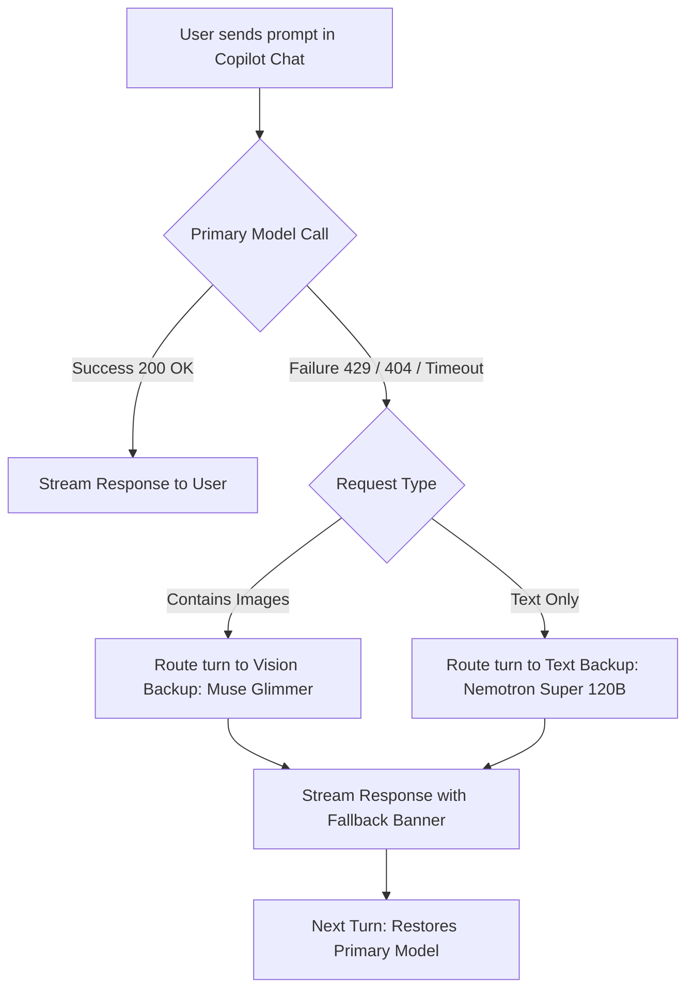

# Failover Engine

Architecture and routing rules for automatic re-routing on API errors.

---

## How Failover Works (Per-Turn Routing)

Cloud inference APIs occasionally return a rate limit (`HTTP 429`), server overload (`529`), a decommissioned model (`404` / `410 Gone`), an empty stream, or a network timeout. When that happens, the extension re-routes the same prompt to a backup model so you don't see an error or have to retype.

1. The extension catches the error on the current turn.
2. It immediately routes the same prompt to a backup model (defaults in [Text vs. Vision Failover](#text-vs-vision-failover)).
3. The backup model streams the response, prefixed with a notice banner (if enabled).
4. On the next turn, the extension tries the original model again.



---

## Text vs. Vision Failover

If the request is text-only, failover uses `nvidia-nim.fallback.model` (default `Nemotron 3 Super 120B`). If it contains images, text-only models would reject it, so the extension routes to `nvidia-nim.fallback.visionModel` (default `Muse Glimmer`).

---

## Priority List

Set `nvidia-nim.fallback.priorityList` to an ordered list of model IDs to try before the single text/vision fallbacks. On each failover step, the next healthy candidate is picked; unknown, unavailable, and already-tried models are skipped.

**Example:** `["moonshotai/kimi-k3", "minimaxai/minimax-m3"]` tries Kimi K3 first, then MiniMax M3, and only then the regular fallbacks. If every candidate fails, the error message lists the full tried chain (`Tried chain: kimi-k3 -> minimax-m3`) with the last underlying error.

---

## Collision Protection

If you are already on the backup model (e.g. `Muse Glimmer`) and *it* hits a rate limit, the extension detects the conflict and routes to the next healthy vision-capable model in the catalog (such as `Kimi K3` or `MiniMax M3`).

---

## In-Chat Notice Banners

On failover, the extension prepends a banner to the response:

```markdown
> NVIDIA NIM Fallback: Request rate-limited on *deepseek-ai/deepseek-v4-flash-0731*. Response generated by *nvidia/nemotron-3-super-120b-a12b*.
```

Disable with `"nvidia-nim.fallback.showNoticeInChat": false` in `settings.json`.
