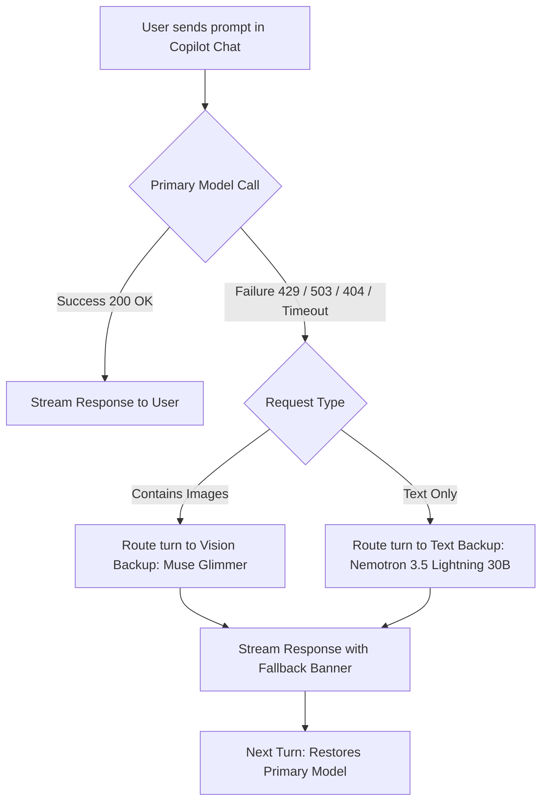

# Failover Engine

Architecture and routing rules for automatic re-routing on API errors.

---

## How Failover Works (Per-Turn Routing)

Cloud inference APIs occasionally return a rate limit (`HTTP 429`), server overload (`HTTP 529` or a stream error `503` "Service temporarily overloaded"), a decommissioned model (`404` / `410 Gone`), an empty stream, or a network timeout. When that happens, the extension re-routes the same prompt to a backup model so you don't see an error or have to retype. A `503` with no text yet is retried on the same model first.

1. The extension catches the error on the current turn.
2. It immediately routes the same prompt to a backup model (defaults in [Text vs. Vision Failover](#text-vs-vision-failover)).
3. The backup model streams the response, prefixed with a notice banner (if enabled).
4. On the next turn, the extension tries the original model again.


```mermaid
flowchart TD
    A[User sends prompt in Copilot Chat] --> B{Primary Model Call}
    B -- Success 200 OK --> C[Stream Response to User]
    B -- Failure 429 / 503 / 404 / Timeout --> D{Request Type}
    D -- Contains Images --> E[Route turn to Vision Backup: Muse Glimmer]
    D -- Text Only --> F[Route turn to Text Backup: Nemotron 3.5 Lightning 30B]
    E --> G[Stream Response with Fallback Banner]
    F --> G
    G --> H[Next Turn: Restores Primary Model]
```

---

## Text vs. Vision Failover

If the request is text-only, failover uses `nvidia-nim.fallback.model` (default `Nemotron 3.5 Lightning 30B`). If it contains images, text-only models would reject it, so the extension routes to `nvidia-nim.fallback.visionModel` (default `Muse Glimmer`).

---

## Priority List

Set `nvidia-nim.fallback.priorityList` to an ordered list of model IDs to try before the single text/vision fallbacks. On each failover step, the next healthy candidate is picked; unknown, unavailable, and already-tried models are skipped.

**Example:** `["moonshotai/kimi-k3", "meta/muse-glimmer-30b"]` tries Kimi K3 first, then Muse Glimmer, and only then the regular fallbacks. If every candidate fails, the error message lists the full tried chain with the last underlying error.

If every candidate **times out** with no visible answer, `nvidia-nim.fallback.maxChainRestarts` (default `2`) starts the same chain again from the original model. Set it to `0` to keep the old one-pass behavior. Mid-stream stalls after text or thinking already went to Copilot are not hopped to another model; those abort the HTTP stream and nudge the same model to keep going (`nvidia-nim.generation.maxLoopContinues`).

---

## Collision Protection

If you are already on the backup model (e.g. `Muse Glimmer`) and *it* hits a rate limit, the extension detects the conflict and routes to the next healthy vision-capable model in the catalog (such as `Kimi K3`).

---

## Retired Models

When NVIDIA retires a model, its endpoint answers HTTP 410. That is permanent, so the extension remembers the model for the rest of the VS Code session: later turns go straight to the backup without calling the retired model, the fallback banner is shown only the first time, the model is left out of every failover chain, and it disappears from the model picker. A plain 404 is not remembered and the model is tried again on the next turn. Restarting VS Code clears the list.

---

## Replies That Only Reasoned

If a model finishes normally after thinking but writes no answer and calls no tool, the extension nudges the same model once to act on its reasoning before treating the turn as empty and failing over. Stalls in the middle of thinking (timeouts, dropped connections) keep their own handling. The nudge counts against `nvidia-nim.generation.maxLoopContinues`, so setting it to `0` turns this off.

---

## In-Chat Notice Banners

On failover, the extension prepends a banner to the response:

```markdown
> NVIDIA NIM Fallback: Request rate-limited on *deepseek-ai/deepseek-v4.1-flash*. Response generated by *nvidia/nemotron-3.5-lightning-30b-a3b*.
```

Disable with `"nvidia-nim.fallback.showNoticeInChat": false` in `settings.json`.
